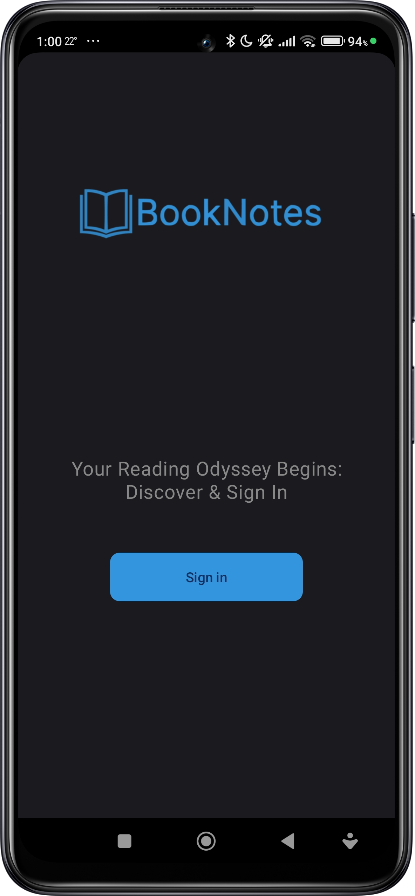
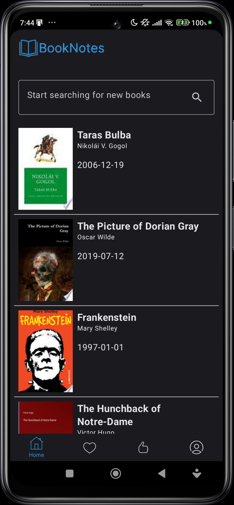
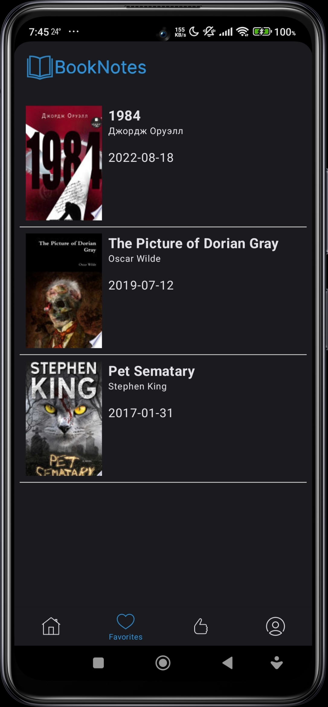
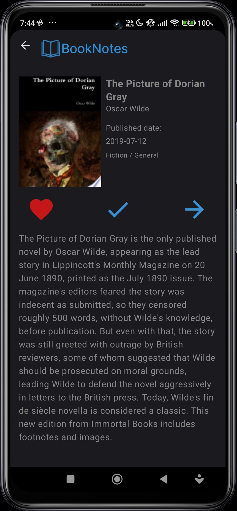

# Book Notes – Book Recommendation System using Machine Learning
=====================================================

## Introduction
---------------

This project aims to develop a book recommendation system using machine learning techniques. The
system is designed to help users navigate through a vast amount of book options and provide
personalized recommendations.

## Problem Statement
--------------------

With the increasing amount of books available online, users face a daunting task of selecting
relevant literature. A recommendation system can alleviate this problem by providing individualized
suggestions and reducing search time. Machine learning enables the creation of systems that can
analyze large amounts of user data and behavior to provide more relevant recommendations.

## Objectives
--------------

The objectives of this project are:

1. **Analyze approaches and methods of machine learning for recommendation systems**.
2. **Find a suitable dataset with sufficient information about books, users, and their interactions
   **.
3. **Develop a hybrid recommendation algorithm and API for its implementation**.
4. **Create a mobile application for book search and personalized recommendations, integrating it
   with the recommendation system**.

## Dataset
------------

The dataset used for training machine learning models is from the BookCrossing.com online community,
where users exchange books and leave reviews. The dataset contains:

* Over 1 million records of book ratings
* Around 280,000 records of user information
* Over 270,000 records of book metadata

## Hybrid Recommendation Algorithm
-----------------------------------

The recommendation algorithm combines **content-based filtering** and **collaborative filtering**.

* **Content-based filtering**: analyzes book characteristics using the Singular Value
  Decomposition (SVD) method.
* **Collaborative filtering**: analyzes user behavior using the K-Nearest Neighbors (KNN) algorithm.

## Evaluation
--------------

The effectiveness of the developed hybrid system was evaluated through testing on real users. Each
of the 12 users was presented with 25 book recommendations generated by the system. Users evaluated
the relevance of each recommendation, responding with "yes" or "no". The results showed a high level
of user satisfaction, with an accuracy of **80% positive responses**.

## Mobile Application
---------------------

The mobile application was developed for the Android platform using Kotlin. The app allows users to:

* Search and view book information using the Google Books API
* Add favorite books to a personalized list
* Implement user authentication using Firebase Authentication

## Integration with Recommendation System
-----------------------------------------

The mobile application was integrated with the recommendation system through a server developed
using the Flask framework. The server provides an API for the Android application and other clients
to retrieve recommendations.

### Screenshots

## Future Work
---------------

Future research plans to:

* Improve the models using deep learning
* Process larger datasets
* Develop algorithms that can handle contextual factors and dynamically adapt to changes in user
  preferences

## Conclusion
----------

The development of a book recommendation system using machine learning techniques has wide
applications in online bookstores, libraries, educational platforms, and social networks for book
lovers. Implementing such systems can increase user satisfaction, personalize the reading
experience, and boost book sales.